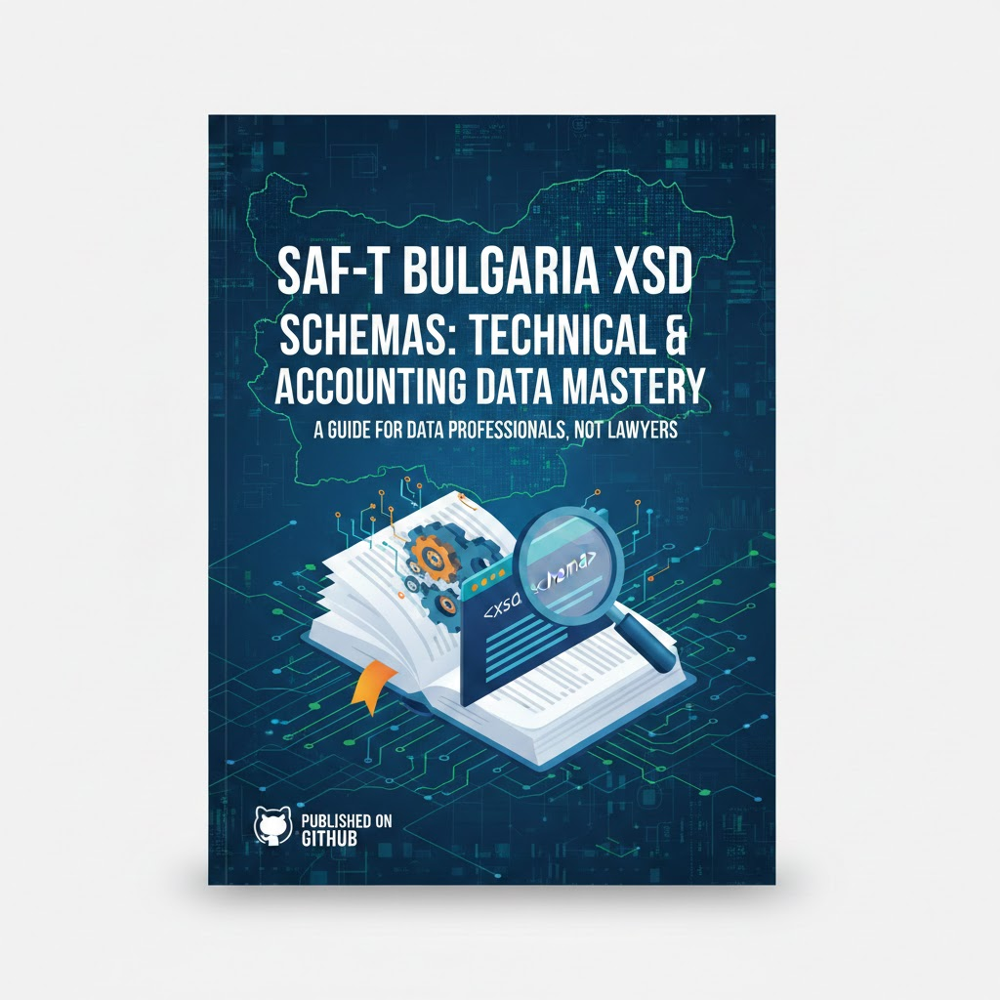

<p align="center">
  
</p>

<h1 align="center">SAF-T в България</h1>
<h3 align="center">Счетоводен и Технически Наръчник за Практици</h3>

<p align="center">
  <a href="#"></a>
  <a href="#"></a>
  <a href="#"></a>
  <a href="#"></a>
  <a href="#"></a>
</p>

<p align="center">
  <i>„SAF-T няма да бъде спечелен в съда. Той ще бъде спечелен в базата данни.“</i>
</p>

---

## Защо тази книга?

Масовият български счетоводен софтуер страда от **генетичен дефект** — проектиран е като плоска таблица с 20-30 свободни текстови полета, наречени „аналитичности". Те нямат релация, нямат валидация, нямат логика. Когато SAF-T изисква структуриран XML изход, тези системи са обречени.

Тази книга е създадена от екипа на **baraba.org** като отговор на нарастващия шум от „правни анализи" на един чисто технически стандарт. Тук ще намерите:

- **Диагноза** на архитектурните проблеми на масовия БГ софтуер
- **Не тълкуване на закони**, а алгоритми и структури от данни
- **Реален код** на Rust, Python, SQL и NoSQL
- **Практически счетоводни решения** от гледна точка на Data Engineer

---

## Съдържание

### Книга

| Файл | Описание |
|------|----------|
| [**FULL_BOOK.md**](FULL_BOOK.md) | Пълният текст на книгата (всички глави) |
| [**SUMMARY.md**](SUMMARY.md) | Резюме на всяка глава |
| [**MANIFESTO.md**](MANIFESTO.md) | Манифест: Защо SAF-T не е за адвокати |

### Основни глави

| Глава | Файл | Резюме |
|-------|------|--------|
| 0 | [CHAPTER_0.md](CHAPTER_0.md) | **Генетични дефекти на масовия БГ софтуер** — плоски таблици с 20-30 varchar аналитичности, менталитетът на „Баба Яга", защо гъвкавостта на входа е смъртна присъда на изхода |
| 0А | [CHAPTER_0A.md](CHAPTER_0A.md) | **Вторият фронт — „Дигиталните еничари“** — сблъсъкът между „старата школа“ и модерните SaaS системи без счетоводно ядро, илюзията за модерност и крахът на интеграцията |
| 1 | [CHAPTER_1.md](CHAPTER_1.md) | **Счетоводителят като Data Engineer** — двойна идентификация на сметки, Data Cleansing на мастър данни, мостът между вашия код и номенклатурата на НАП |
| 2 | [CHAPTER_2.md](CHAPTER_2.md) | **XML и Namespaces** — защо XML а не Excel, nsSAFT: префикс, четирите клона (Header, MasterFiles, GeneralLedger, SourceDocuments), XSD валидация |
| 3 | [CHAPTER_3.md](CHAPTER_3.md) | **Двойният сметкоплан** — 360 стандартни сметки на НАП, AccountID vs TaxpayerAccountID, данъчни кодове TaxTable |
| 4 | [CHAPTER_4.md](CHAPTER_4.md) | **Материални запаси** — On-Demand отчет като дигитална ревизия, PhysicalStock, MovementOfGoods, конверсии на мерни единици |
| 5 | [CHAPTER_5.md](CHAPTER_5.md) | **Номенклатури и кореспонденции** — Movement Types, мапинг двигател с SurrealQL, Python уеднаквяване на мерни единици |
| 6 | [CHAPTER_6.md](CHAPTER_6.md) | **Техническа реализация** — ~1300 реда Rust, streaming XML с quick_xml, SAF-T ID префикси, Monthly/OnDemand/Annual, Pre-flight валидация |
| 7 | [CHAPTER_7.md](CHAPTER_7.md) | **Епилог** — край на търговията със страх, счетоводителят като Data Engineer, истината е в кода |

### Разширени глави

| Глава | Файл | Резюме |
|-------|------|--------|
| 8 | [CHAPTER_8.md](CHAPTER_8.md) | **Data Engineering** — ETL pipeline, SurrealDB schema, Rust типобезопасни модели, Python Data Wrangling, PostgreSQL schema, Data Quality Framework |
| 9 | [CHAPTER_9.md](CHAPTER_9.md) | **SQL vs NoSQL** — PostgreSQL vs SurrealDB, Graph relations, хибриден подход с Rust sync, performance optimization и benchmarking |
| 10 | [CHAPTER_10.md](CHAPTER_10.md) | **Тестване и QA** — 5 слоя валидация (XSD, Data Type, Referential Integrity, Cross-module, Business Logic), Pytest, CI/CD |
| 11 | [CHAPTER_11.md](CHAPTER_11.md) | **Реални казуси** — търговец (дедупликация), производител (VIES), холдинг (консолидация), ЕТ (опростен pipeline) и анализ на стратегическата грешка с липсващото е-фактуриране |

### Приложения

| Файл | Съдържание |
|------|------------|
| [APPENDICES.md](APPENDICES.md) | 360 SAF-T сметки, данъчни кодове, мерни единици, типове движения, SAF-T ID префикси, пълен XML пример, FAQ |

---

## Технологичен стек

```
┌─────────────────────────────────────────────────────────────┐
│                    SAFT-T BOOK STACK                        │
├─────────────────────────────────────────────────────────────┤
│  Backend    │  Rust (Dioxus 0.7, quick_xml, serde)          │
│  Database   │  SurrealDB, PostgreSQL                        │
│  Processing │  Python (pandas, lxml)                        │
│  Validation │  XSD, Pytest, GitHub Actions                  │
│  Schema     │  BG_SAFT_Schema_V_1.0.1.xsd (НАП)             │
└─────────────────────────────────────────────────────────────┘
```

### Примери за код

| Език | Употреба |
|------|----------|
| **Rust** | Типобезопасни модели, XML streaming generator, validation engine |
| **Python** | Data wrangling, pandas pipelines, XSD validation, VIES integration |
| **SQL** | PostgreSQL schema, triggers, views, аналитични заявки |
| **NoSQL** | SurrealDB DEFINE TABLE, Graph relations, SurrealQL |

---

## Ресурсни файлове

В папката `SAFT_BG/` ще намерите официалните ресурси от НАП:

| Файл | Описание |
|------|----------|
| `BG_SAFT_Schema_V_1.0.1.xsd` | Официална XSD схема |
| `VS_SAMPLE_AuditFile_Monthly_V_1.0.1.xml` | Примерен месечен файл |
| `VS_SAMPLE_AuditFile_Annual_V_1.0.xml` | Примерен годишен файл |
| `VS_SAMPLE_AuditFile_OnDemand_V_1.0.xml` | Примерен On-Demand файл |

---

## За кого е тази книга?

| Аудитория | Какво ще научат |
|-----------|-----------------|
| **Счетоводители** | XML структура, мапинг, номенклатури |
| **Data Engineers** | Счетоводна логика, двойно записване |
| **Разработчици** | SAF-T имплементация, Rust/Python код |
| **IT Мениджъри** | Архитектура, интеграция, CI/CD |

---

## Бърз старт

```bash
git clone https://github.com/katehonz/saf-t-bg.git
cd saf-t-bg
```

Започнете с [FULL_BOOK.md](FULL_BOOK.md) или с [MANIFESTO.md](MANIFESTO.md).

---

## Контрибуция

Тази книга е „жив“ документ. Ако сте счетоводител или разработчик и имате:

- Интересен казус със SAF-T
- Подобрения в кода
- Поправки в текста

Отворете **Issue** или **Pull Request**.

---

## Лиценз

MIT License — свободна за използване и разпространение.

---

<p align="center">
  <i>Издадено от екипа на</i> <b><a href="https://baraba.org">baraba.org</a></b>
</p>
